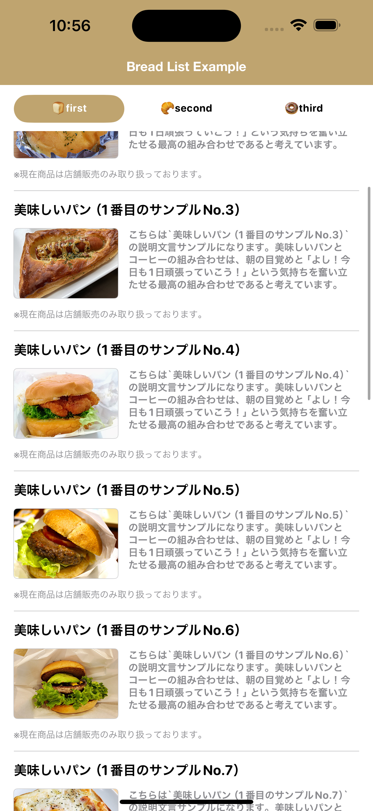
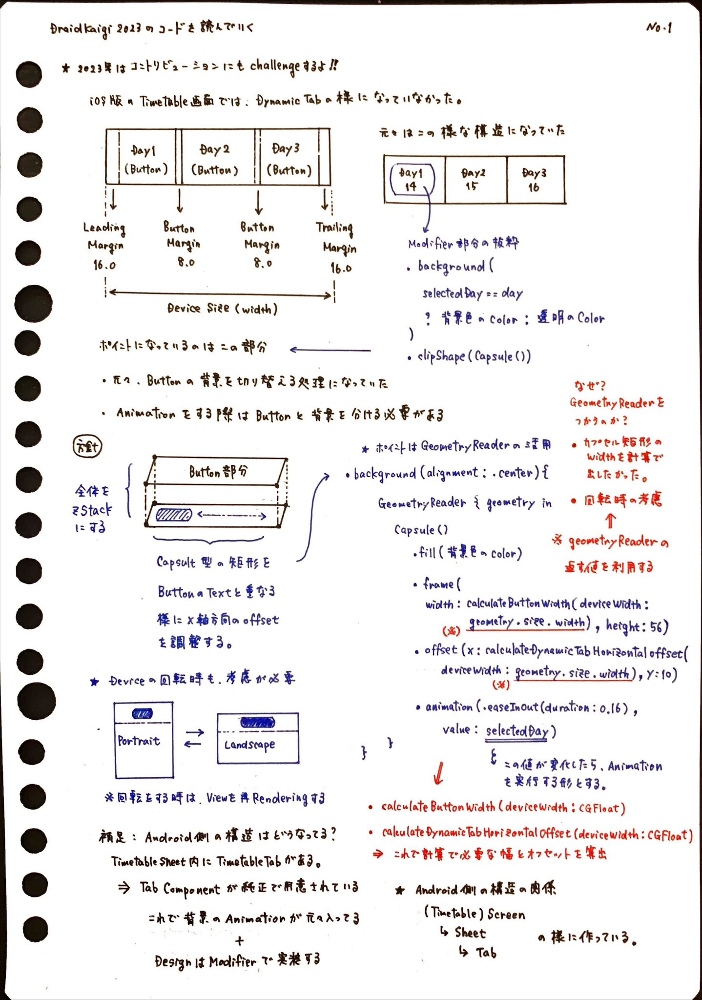
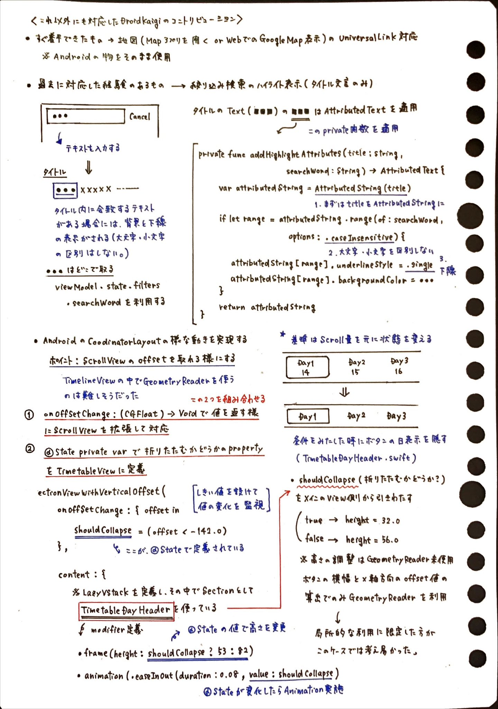
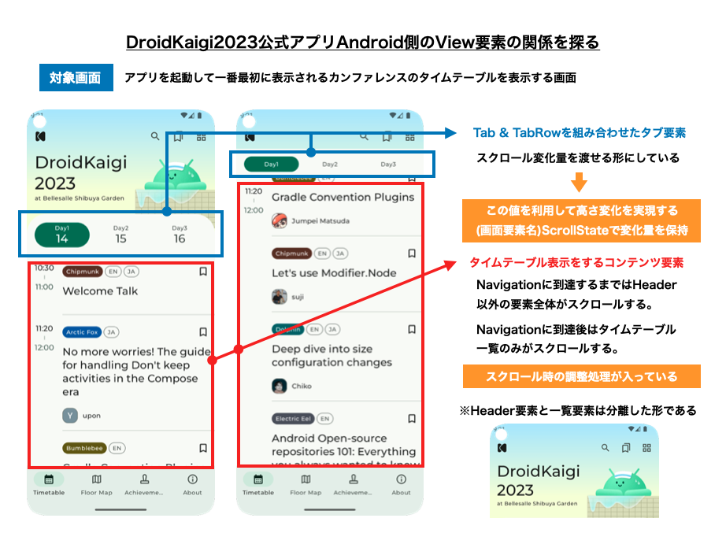
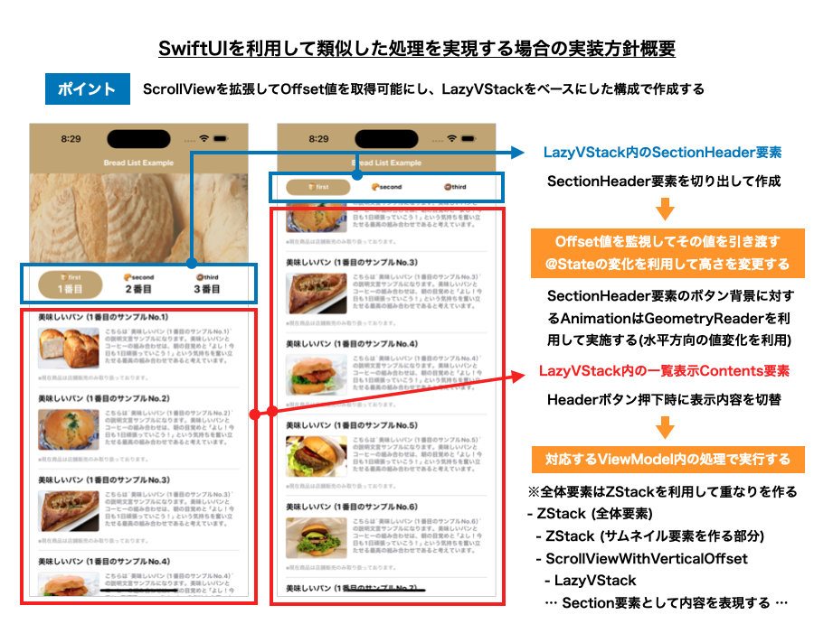

# [ING] - AndroidのCoodinatorLayoutの様な動きをSwiftUIで作成するサンプル

### 1. 解説資料

こちらは「After iOSDC LT Night (9/13)」＆「potatotips #84 (9/26)」での登壇資料内で紹介したサンプル実装になります。

- [Footprints about Contribution of DroidKaigi 2023](https://speakerdeck.com/fumiyasac0921/footprints-about-contribution-of-droidkaigi-2023)

### 2. サンプル画面デザイン

このサンプルの元になっているのは、[DroidKaigi2023のContribution](https://github.com/DroidKaigi/conference-app-2023/pulls?q=is%3Apr+is%3Aclosed+author%3Afumiyasac)でUI実装関連対応における、AndroidのCoodinatorLayout(NestedScrollView)に類似した表現を実現する部分を抜き出したものになります。

__【🖼️ Screenshots】__

Expand | Collapse
:--: | :--:
 | 

__【🎥 Movie】__

https://github.com/fumiyasac/LikeCoodinatorLayoutExample/assets/949561/bcad0aa6-9254-4d59-b4ad-cc23a3d51b31

### 3. 設計資料

Contributionを実施した際の設計メモや、iOS⇔Android間のView実装を見比べた際の着眼点を下記にまとめています。

__【📝 Note of DroidKaigi2023 Contribution】__

__【📑 Policy of UI Implementation】__

